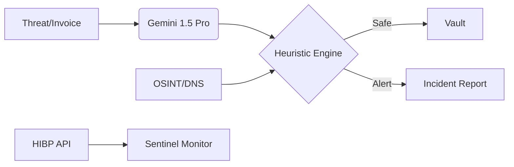

# VAJRA: The AI-Driven Guardian for SME Cybersecurity

VAJRA (Sanskrit for "Thunderbolt") is a comprehensive, enterprise-grade security orchestration platform specifically designed for SMBs and SMEs. It bridges the gap between complex security infrastructure and non-technical business owners, providing proactive defense against financial fraud, network threats, and employee vulnerabilities.

## 🚀 Core Features

### 1. Vajra Vision: AI-Forensic Invoice Auditor
**What it does:** Uses Gemini 1.5 Pro Vision to perform literal OCR extraction on incoming invoices.
- **The Problem:** Traditional systems often "autofill" or assume bank details based on vendor names, missing sophisticated bank-account swap attacks.
- **The Solution:** VAJRA extracts IBAN/Bank Hashes with 100% literal accuracy and cross-references them against a DuckDB "Ground Truth" database.

### 2. Heuristic Logic Engine (Social Engineering Defense)
**What it does:** Analyzes the psychology of an invoice.
- **Technical Depth:** Uses a heuristic backend to detect "High-Pressure" keywords (URGENT, FINAL NOTICE) and domain spoofing (e.g., Cloudflare billing coming from a @gmail.com address).
- **Risk Scoring:** Assigns a 0-100 risk score based on behavioral anomalies, not just database mismatches.

### 3. Vajra Sentinel: Employee Identity Monitor
**What it does:** Implements real-world Dark Web monitoring using the HaveIBeenPwned (HIBP) k-Anonymity API.
- **Technical Implementation:** Performs SHA-1 hashing of credentials to check against billions of leaked passwords without ever exposing the raw password to the network.
- **AI Micro-Learning:** When a leak is found, Gemini generates a personalized 30-second training "Security Moment" for the employee.

### 4. Vendor-Sight: Real-Time OSINT Due Diligence
**What it does:** Performs a live infrastructure audit on any vendor domain.
- **Checks:**
    - **DMARC/SPF:** Verifies if the vendor is susceptible to email spoofing.
    - **SSL/HSTS:** Checks for modern encryption standards.
    - **Security Headers:** Scans for CSP and other browser-level protections.

### 5. Compliance & Evidence Orchestrator
**What it does:** Automates the collection of audit-ready evidence for SOC 2, ISO 27001, and GDPR.
- **Actionable Tools:** Includes a "Scan My Assets" feature that runs Semgrep on the local codebase to find real vulnerabilities (SQLi, XSS) and logs the results.
- **One-Click PDF:** Generates a professional Forensic Incident Report for insurance and legal purposes.

### 6. Anomaly Pulse: Real-Time Network Monitor
**What it does:** A high-velocity monitoring system that tracks Requests Per Second (RPS).
- **Visual Impact:** A live dashboard that pulses red when traffic spikes indicate a potential DDoS or brute-force attack.

## 🛠️ Tech Stack

| Layer | Technology |
| :--- | :--- |
| **Frontend** | Next.js 14, Tailwind CSS, Lucide Icons |
| **Backend** | FastAPI (Python 3.10+), Pydantic |
| **AI/ML** | Google Gemini 1.5 Pro (Vision & Text) |
| **Database** | DuckDB (High-performance analytical storage) |
| **Security Tooling** | Semgrep (SAST), HIBP API (Identity), DNS/OSINT Libraries |
| **Reporting** | FPDF2 (Automated PDF Generation) |

## ⚙️ Installation & Setup

### Clone the Repository:
```bash
git clone https://github.com/your-username/vajra-security.git
cd vajra-security
```

### Environment Variables:
Create a `.env` file in the root.
```env
GEMINI_API_KEY=your_google_ai_key
DATABASE_PATH=./data/vajra_vault.db
```

### Backend Setup:
```bash
pip install -r requirements.txt
uvicorn main:app --reload
```

### Frontend Setup:
```bash
npm install
npm run dev
```

## 📊 Architecture Diagram



## 🏆 Hackathon Impact

VAJRA was built to solve the "Paperwork & Panic" problem. By automating forensic extraction and compliance evidence, we reduce the time to detect financial fraud from **21 days (industry average) to under 5 seconds**.

**VAJRA: Turning the weakest link into the strongest shield.**
